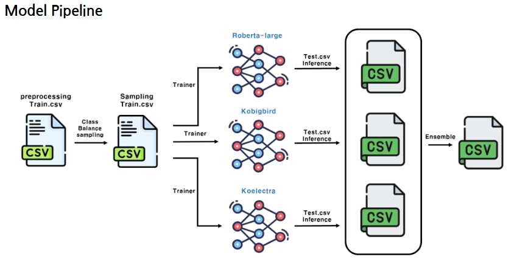

# AI-text-detection

# SW 중심대학 경진대회 (AI 부문)
- 주제: 생성형 AI(LLM)와 인간 (텍스트 판별 챌린지)
- 기간: 2025.07.01 ~ 2025.07.15 
- Private Score : 0.93025
- 결과: 팀 271 중 3위  
- 소속: 가천대학교 AI소프트웨어학부

 

## 21 원정대

| 김의진 | 장희진 | 정승민 |
| :---: | :---: | :---: |
|  |  |  |

# 실험 환경

- NVIDIA GeForce RTX 3090
- CUDA Version: 12.5
- Ubuntu 22.04.5
- python 3.11.4

## 라이브러리

자세한 라이브러리는 ./environment 참고

### 주요 라이브러리
- torch 2.5.1
- transformers 4.46.3
- torchvision 0.20.1
- torchaudio 2.5.1
- scikit-learn 1.5.1
- peft 0.14.0

# pipeline

- Data pipeline

- Model pipeline

# code
- ./EDA.ipynb : data EDA code
- ./aug_data : Data pipeline code
- ./environment : conda 가상환경 yaml, txt 및 pip requirement.txt
- ./kobigbird_925 : vaiv/kobigbird-roberta-large code and ckpt
- ./koelectra_924 : monologg/koelectra-base-v3-discriminator code and ckpt
- ./roberta-large_929 : klue/roberta-large code and ckpt
- ./labeling_ckpt : pseudo labeling 용 ckpt 
- ./ensemble.ipynb : 최종 앙상블 csv 제작 코드

# 모델 출처
- [rtzr/ko-gemma-2-9b-it](https://huggingface.co/rtzr/ko-gemma-2-9b-it)
- [vaiv/kobigbird-roberta-large](https://huggingface.co/vaiv/kobigbird-roberta-large)
- [monologg/koelectra-base-v3-discriminator](https://huggingface.co/monologg/koelectra-base-v3-discriminator)
- [klue/roberta-large](https://huggingface.co/klue/roberta-large)